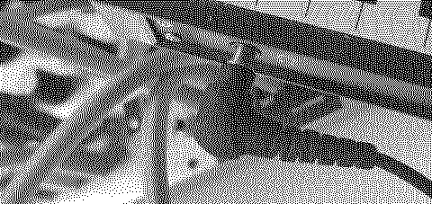

# Monomaniac

A mod to toggle norns input to mono or stereo.

# Instructions

Install the mod, and it will appear `SYSTEM > MODS`, disabled by default. Enable it, restart norns. `E3` clockwise will enable mono input, or more precisely routing left input to both left and right channels. Clockwise will return back to routing left input to left channel and right input to right channel.

Note the mod will not currently save state and does not *actually* know if it is in mono or stereo mode.. sorry this is a little sketchy. Use your ears! Rebooting norns will always return norns to the nornal stereo mode.

# Background

I recently got into Eurorack, and have no output module. So everything is hard left, which gets on your nerves at some point.



I mix between using NTS-1 and it's ensembler, the above OG mono-to-sterea cable half-insertion "hack", and now wrote this.

Some norns script have an option to only record from left input. Great! Not all do, so this is a system level routing change at the level of Jack which will reroute left input audio to both left and right input channels. It is messing with stuff underlying norns, hence no state saving at this stage.

I often have multiple input devices besides the audio jacks on norns (mine is the shield), but in it's current form this does not make those mono (I don't need this feature now), or allow selecting which ones to make mono and which not.

The name is from Scarletron's 1998 killing electro track, which has been an earworm of mine for... yes 25 years now. Play it loud!!

Comments, feedback etc of course welcome!

# Installation

```lua
;install https://github.com/xmacex/monomaniac
```
